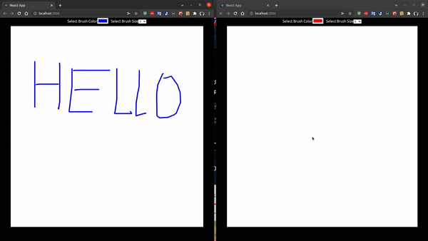

### Create a collaborative white board using Node.js, ReactJS, Socket.io, canvas



#### Client

- sử dụng `socket.io-client`
- dùng code vẽ trên canvas bằng chuột trên stackoverflow: https://stackoverflow.com/questions/2368784/draw-on-html5-canvas-using-a-mouse
- setup
```bash 
  npx create-react-app client
  npm install socket.io-client
  npm start
```
#### Server

- sử dụng `socket.io`, `express`
- setup
```bash
  npm init
  npm install express socket.io
  node server.js
```

#### bug
- CORS policy: No 'Access-Control-Allow-Origin' header is present on the requested resource.: https://stackoverflow.com/questions/44628363/socket-io-access-control-allow-origin-error

#### References

- https://www.youtube.com/watch?v=LZTWYdU4nKk
